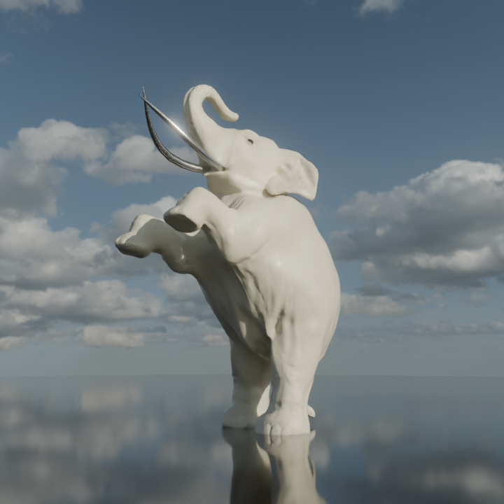

# DANCING ELEPHANT — 3D

## Overview

A 3D elephant character sculpt created in Blender as part of my Hack Club Stardance project.

## Workflow

* **Reference:** Gathered reference images from Google to study anatomy and proportions.
* **Blockout:** Built the initial form from primitive meshes and used Boolean operations to create a unified base.
* **Remesh:** Applied a Remesh modifier to create unified geometry for sculpting.
* **Sculpting:** Added skin wrinkles, muscle structure, bone definition, nails, and other surface details.
* **Poly Count:** ~470,000 faces (high-poly sculpt).

## Render

## Project Info

* **Software:** Blender
* **Type:** 3D Character Sculpt
* **Focus:** Sculpting & Anatomy
* **Poly Count:** ~470,000 faces
* **Status:** Completed
